# 38-0.app vs Futbol — Full Playthrough Comparison & Improvement Plan

**Date:** 2026-10-03 · **Scope:** every screen of both products, played end to end, compared on UI, UX, game feel, simulation credibility, retention, sharing, content/SEO, performance and business model.
**Previous research:** [38-0-app-research.md](38-0-app-research.md) (July audit) and [futbol-38-0-revamp-plan.md](futbol-38-0-revamp-plan.md) (the 11-phase parity plan, all phases marked complete). This doc is a fresh, *live* comparison: what 38-0 looks like today, what Futbol actually does when you play it today, and what to change next.
**Screenshots:** [assets/38-0-vs-futbol-2026-10/](assets/38-0-vs-futbol-2026-10/) (`3800-*` = 38-0, `futbol-*` = Futbol).

> **Framing.** 38-0 is a *single-league* game (English top flight; a Spanish league opens 2026-10-04) that goes extremely deep on one competition. Futbol is a *multi-league* game (Premier League, LaLiga, Serie A, Bundesliga, Ligue 1). The goal is not to clone 38-0. Match its polish and game feel, then win where five leagues give you something one league never can.

---

## Status & next session (updated 2026-10-03, branch `fix/p0-audit-fixes`)

**Done this session (all P0s in §3 except B20):** B1 lineup fidelity (user slot choices are stored and simulated exactly; illegal placements 400; auto-fill now exact → compatible → same group → anything) · B2 legend colours · B3/B4 narrative verdict + composition · B5 daily copy · B6 reveal counter across January · B7 (fixed by B1) · B8 `formatSeason` "2013/14" · B9/B10 season header + Double copy · B11 Europe "top eight" copy · B12 live landing stats + "Play with Mates" card · B13 draft persistence + "Continue your draft" · B14 scroll-to-top · B15 404 + `/signin` redirect · B16 GET retry/backoff + friendly 5xx copy · B17 daily pre-generation · B18 bracket aggregate scores + stage labels in the Europe log · B19 "Kings of Europe" + "The Double" trophies. Also: Premier League default league, era slider bounded by each league's real season span (`minSeasonYear`/`maxSeasonYear` on `/catalog/leagues`), redundant era presets hidden.

**Verified:** `pnpm typecheck` green (10 packages); api 97 tests, web 135 tests green. Live against the real API/worker/DB: lineup stored exactly as submitted (and an illegal one rejected); full season + Europe run showed scored ties ("5-1 agg", Final "1-2"); a run that won the league and the Final was awarded `champions, european-champion, the-double`; `/daily/today` answers in <1s; landing stats render 5 leagues / 141 nationalities / 173 clubs / 2012/13–2024/25; Setup defaults and slider; scroll reset; reload mid-draft keeps the draft. Not clicked through visually end to end (the Browser pane was hidden, which freezes the draft-wheel animation).

### Session 2 (2026-10-04) — B20 calibration, Daily, P1 UX list

**Calibration (B20 + §5.1–5.3):** new `tools/sim-lab/src/real-league.ts` rebuilds the live pipeline (real dataset, seed-real's exact attribute generation, latest-season AI fill, matchday order, the worker's fitness dip, a bench-less user XI). Baseline confirmed the audit: PL champion ~68, strength↔finish ρ ~0.6, Overall-90 XI ~9th. Fixes: OVR stage-2 curve (`tools/data-etl/ovr_spread.py`, applied to the shipped json.gz by `apply_ovr_spread.py`; range 58–97, 90+ = top ~1.5%), quality = (OVR−62)/35 (`@futbol/engine/testing` `overallToEngineQuality`, shared by seed-real + sim-lab), engine `GK_SAVE_PIVOT` 0.5→0.36. Result: champions LaLiga ~89 / Serie A ~86 / PL ~77 (its top five really are close in the data) / BL ~76 & L1 ~78 (34 games); ρ 0.79–0.91; 2.4–3.1 goals/game. `pnpm --filter @futbol/sim-lab calibrate --write` regenerates `apps/web/src/lib/projectionTable.ts` (per league × overall); `computePreseasonOdds(overall, leagueId)` reads it. World settings now store `leagueId` + the shown `projection`; the verdict uses it. Squad tiers re-cut to what the projection says (88+ Galácticos … <74 Minnows); unit tiers re-cut from simulated drafts (typical drafted XI: ~81 Season, ~85 Prime).
**Daily (§4.13):** reel draws are boosted 30% toward unmet requirements (`poolStats.clubSeasonIdsPerConstraint`, backfilled on read), completion odds are a DP over the real mechanic (fresh dailies start ~70–90%, not 0%), yesterday recap (`GET /daily/yesterday`), attempt counter (`GET /daily/:id/me`), friendly date, reroll button only after a draw.
**P1 UX (§10):** one-row header + mobile menu + Play button; compact Setup (2–3-up controls, collapsed Advanced, sticky CTA, SVG league flags + season span; settings already persist); draft room action column first on phones, inline "Place in (N)" pills, ringed valid slots, versatility chips, full position names, surnames on the pitch, no nested scrolls; no username gate (silent guest named after the XI) and one Simulate press (`/season` autostarts); reveal 1x/2x/4x (1x ≈ 30s/season) + "Skip to January"/"Skip to the end", newest-6 feed; January event layer (Bargain Buy / Wheeler Dealer choose-1-of-3 / Deadline Day / Loan Swap / Star Wants Out — deterministic per season+club, `GET .../january/:seasonId/offer`) + halfway position & GD; results hub hero → story → trophies → share, League tab default, table/log behind expanders; image share cards (Canvas, 1080×1350) for season / January / Europe with Share / Save / WhatsApp / Copy caption; Europe opt-in + renamed "European Nights"; collapsed leaderboard filters with removable pills + `pnpm wipe:test-leaderboard` (dry run by default, `--apply`, `--all`); club display names (`lib/clubNames.ts`) + league tabs; nation flags; per-route titles; W = green, gamble = amber; full footer sitemap + "Feedback & bugs".
**Verified:** typecheck 10/10; api 104, web 148, sim-lab 5 (incl. a real-league table-shape test), engine 7, sim-worker 5. Live: Setup/draft room/leaderboard on a 375px viewport; January offer/resolve end to end against API + worker.
**Needs the user:** `pnpm seed:real` (from packages/db) to load the new ratings/attributes, then restart api + sim-worker; until then the DB has old-scale ratings while tiers/projections expect the new scale. Then `pnpm wipe:test-leaderboard -- --all --apply` (old-scale runs) when ready.

### Session 3 (2026-10-04) — P2 started: profile + trophy cabinet

**Done:** reseeded (`pnpm seed:real`, new 58–97 scale live). `/profile` replaces `/history` (redirect kept): career stats (seasons, titles, win rate, best points/record, top-rated XI, avg finish, goals, best win streak, favourite formation/league, unbeaten/European titles), streaks (title run, unbeaten run, on the up, days played), Daily summary, "Trophy of the week" (rotating locked single-run trophy + Start a run), and a 37-trophy cabinet with category tabs, catalogue/rarest/earned sort, tiers, live "% of players", locked cards with progress bars. Each run row shows league flag, finish "1st of 20", W-D-L, points, trophies, and "View season" when the stats hub is cached in this browser. Catalogue grew 12 → 37: season (Top Four, Centurion, Goal Machine, Fortress, Overachievers, Miracle Season), squad composition (United Nations, Homegrown, Foreign Legion, Class Of, Time Travellers, Band of Brothers, Dad's Army, Fledglings), career with progress (Regular, Veteran, Serial Winner, Dynasty, Tactician, Globetrotter, Five-League Champion — the first cross-league trophy) and fun (Great Escape, Bottle Job, Down With the Ship, Alphabet Soup). `finalizeRun` now records the full season line and back-fills `settings.leagueId`.
**Verified:** typecheck 10/10; api 124 (+27), web 163 (+15) tests. Live: guest → Man City 2021 drafted → 380-fixture season (104s) → finalize ×2 (idempotent) → champions / top-four / golden-glove / fortress / class-of / band-of-brothers; `/profile` rendered on desktop and 375px.
**Not done yet (rest of P2):** share-your-cabinet image; rebuilding a past run's stats hub from the server (today it needs the local cache); Daily calendar themes + archive; passwordless auth (needs Google OAuth client + an email provider — user decision); current-season data 2025/26; PWA install; per-league Best XI pages; landing "seasons simulated" counter; Prime-as-default decision. Test guest "ProfileE2E" + its world remain in the dev DB.

**Next session:** reseed + a full live season on the new data (check the reveal pacing, January event reel, hub order and share images on a real phone); P2 items (profile/trophy cabinet, passwordless auth, Daily archive/calendar, current-season data); P3 cross-league European Nights. Recommendation to consider: make Prime the default ratings mode (a typical Season-ratings draft now projects mid-table in the PL; Prime ≈ 38-0's "projected 2nd" feel).

**Start next session here (original list — items 1–3 done 2026-10-04, see above):**
1. **B20 + §5 credibility work** — calibrate `apps/web/src/lib/preseasonOdds.ts` against real simulated seasons (sim-lab: N seasons per overall bucket with a realistic AI-filled league), then the OVR top-tail re-fit (`tools/data-etl`), percentile-based squad/unit tiers, AI-league table realism (add a table-shape metric to sim-lab). Evidence: overall 90 projects "4th / 89 pts" but the champion scored 69; an XI of ten 98-rated players finished 2nd; nothing under ~100 projects 1st.
2. **Daily completion odds start at 0%** (`lib/dailyOdds.ts`) + yesterday recap/attempts (§4.13).
3. **P1 UX parity list** (§10): compact mobile header/nav, compact Setup, inline "Place in" pills + valid-slot highlighting + all eligible position chips, no nested scrolls + sticky action bar, single Simulate click / no username gate, faster reveal + speed + skip-to-January, January event-type layer, results hub reorder (story first, League tab default), image share cards, Europe opt-in + rename from "Champions League", collapsed leaderboard filters + wipe test data, club display names + flags, per-route titles, colour semantics (§6.1).

**Housekeeping:** test guest users/worlds from this session ("AuditTester", "LineupE2E", "EuropeE2E") remain in the dev DB. Screenshots in `plans/assets/38-0-vs-futbol-2026-10/` include 38-0 UI captures for internal research — consider keeping them out of any public repo.

## 0. TL;DR — the 12 things that matter most

| # | Finding | Severity |
|---|---|---|
| 1 | **The engine doesn't play the XI the user drafted.** The web app sends a flat list of player IDs, and the API re-builds the lineup greedily by each player's *primary* position, dropping "best remaining" players into slots they can't play. In my run Luis Suárez (95, ST) played right-back and scored **1 goal**, while Dejan Lovren (CB) played striker and scored **16**. Pitch, share card and narrative all show the user's arrangement; the simulation uses a different one. | **P0 bug** |
| 2 | **Ratings and tiers are inflated, so nothing feels earned.** Butland 89, Mings 90, Gvardiol 98, McCarthy 84 → XI overall **90, "Galácticos"**, and all four units "Elite". On 38-0 a Lampard/Rooney/Campbell/Rice XI is **86**. Squad tiers, narrative tiers and the leaderboard tier filter all saturate at the top. | P1 credibility |
| 3 | **The projection doesn't match the simulation.** Pre-season said *4th, 89 expected points, 21% title*. I won the league on **69 pts**. The AI table was flat (2nd on 61; Liverpool 11th, Chelsea 18th, Southampton 10th). The "can you beat the projection?" tension that drives 38-0 is broken. | P1 credibility |
| 4 | **The multi-league advantage is mostly invisible.** The league picker is plain text tiles (Bundesliga is the default because it sorts first alphabetically), and there's no "All Top-5" mode. Your "Champions League" is the top 8 of *your own* league replaying each other. Meanwhile single-league 38-0 now ships European Nights against **real** continental clubs (36-team league phase, full bracket, a real champion), plus three European competitions, a European-clubs draft, and a Spanish league. They are building toward your differentiator. | P1 strategy |
| 5 | **Mobile UX lags.** The header stacks into 3 rows (≈30% of a 375px screen) and has no hamburger. Setup is ~5 screens of full-width tiles. The player pool sits in a nested scroll box. Picking a slot means scrolling *up* to the pitch. Route changes keep the old scroll position. A reload mid-draft throws the draft away. | P1 UX |
| 6 | **Friction lands at the emotional peak.** A forced username modal blocks "Simulate". Then the Season page needs a *second* "Simulate season" click. Then come dead waits: ~8–10s "Kicking off…", ~27s "Wrapping up the season…", ~31s "Kicking off the Champions League…". 38-0 starts revealing results within ~2s and never gates simulate. | P1 UX |
| 7 | **The reveal is ~3.5× slower than 38-0** (~2.5s per match ≈ 90s+ per season vs ~25s), with no speed control and no "skip to January". | P1 UX |
| 8 | **Sharing is text-only.** "Copy result to share" puts text on the clipboard. 38-0 renders a share *image* (season card, January card, Europe card) with Share / Save image / WhatsApp / Copy caption. Sharing is 38-0's whole growth engine. | P1 growth |
| 9 | **The retention layer is thin.** Futbol `/history` is a list of runs. 38-0 `/profile` has career stats (win rate, best points, favourite formation), streaks (unbeaten run, title run, "on the up"), and an **82-trophy cabinet** with locked trophies, progress bars, rarity sort, league tabs, a weekly highlighted trophy and "share your cabinet". | P2 retention |
| 10 | **Narrative quality bugs.** The verdict says *AS EXPECTED* after projected 4th → champions. The composition line contradicts itself ("elite… undermined by a shakier attack" when every unit is Elite) and has a grammar slip ("a elite"). The manager line just quotes the philosophy back. 38-0's lines reference what actually happened (goals, results, January). | P1 polish |
| 11 | **Daily Challenge** themes are procedural and obscure ("Club Legends: US Salernitana 1919"), the first load takes **31s**, completion odds start at **0%**, and the brief has copy bugs ("…at US Salernitana 1919s"). 38-0's Dailies follow the real calendar: tonight's internationals, birthdays, derbies, news. They also have a 112-day archive. | P2 |
| 12 | **Polish/correctness debt** (each small, together they hurt trust). The legend colours contradict the pitch colours. Seasons show as "2013" not "2013/14". "1 clubs in this save". "Treble of storylines" (it was a Double). Europe copy says "top four" while the code qualifies 8. The landing page claims "12 leagues / 1992–2025" while the data is top-5, 2012–2024. The Head-to-Head card is stale. 404 is blank. Every route has the same `<title>`. There's no trophy for winning the Champions League. | P0–P1 |

**What Futbol already does better (keep and promote):** real player photos; league-wide awards and top-10 scorers across all 20 clubs (38-0's awards only cover your own XI); a full standings table with every column; five real leagues with a league filter on the leaderboard; real managers whose tactics genuinely change the sim; a Nations directory across 136 nationalities; and async leagues *and* turn-based live draft already built.

---

## 1. How this was tested

**38-0.app (live, 2026-10-03, guest, no account created):**
- Full Classic run: 4-3-3 · Normal · Squad First · Prime (now the default) · All-time (1992/93–2026/27) · Managers + European Nights + January all on (all default on).
- Drafted an XI (overall 86) and spun Jürgen Klopp. Pre-season: projected 2nd / 80 pts. Simulated, took the January gamble (event type *Wheeler Dealer*), finished **2nd on 72 pts**. Entered European Nights → league phase → **29th of 36, out**. Opened both share cards.
- Pages visited: landing (English and Spanish modes), Daily + Daily archive, Multiplayer hub, Leagues, Last One Standing, One-Club XI, European Nights: Draft, Tournaments, Teammate Chain (to the start screen), Supporter Pass, Partners, Download, Story, How It Works, How to Play, Greatest XI, the three SEO landing pages, Leaderboard, Profile/Trophy cabinet, Terms, Refunds.
- Not played (need an account or payment): Live Draft, Leagues creation, Last One Standing events, Tournaments, European Nights: Draft. No account was created, nothing was submitted to their leaderboard, and their copy is paraphrased here rather than reproduced.

**Futbol (local stack: api + sim-worker + web against the dev Neon DB):**
- Same settings where possible: Premier League · 4-3-3 · Normal · Squad First · Season ratings (Futbol's default) · All-time · all advanced toggles on.
- Drafted an XI (overall 90 "Galácticos") and drew Vincent Kompany. Pre-season: projected 4th / 89 pts. Created a guest username at the gate, simulated, took the January gamble (+2 OVR), **won the league on 69 pts**, then **won the Champions League**.
- Visited every route: `/`, `/setup`, `/draft`, `/season`, `/history`, `/leaderboard`, `/daily`, `/clubs`, `/nations`, `/multiplayer`, `/how-it-works`, `/how-to-play`, `/best-xi`, `/story`, `/signin`, and an unknown route.
- Viewports: mostly 375×812 (38-0 says roughly ¾ of its traffic is mobile) and ~560px, plus a desktop check.

**Caveat on timings:** both apps were driven in an automated browser pane, and Futbol's backend is a remote free-tier database. Timings are indicative, but the *relative* gaps (2s vs 10–30s) are large enough to matter.

---

## 2. What 38-0 has shipped since the July audit

| Area | July 2026 | Now (Oct 2026) |
|---|---|---|
| Leagues | English top flight only | English + **Spanish top flight** (49 clubs, ~19k player-seasons, supporters' early access now, everyone from tomorrow). The whole site re-themes to gold/amber when you switch. |
| Dataset | 4,000+ player-seasons, 1992–2026 | **18,000+** English player-seasons, 1992/93–**2026/27** (the current season is draftable) |
| Europe | Toggle; "top four" | **Three European competitions** (a Champions-League analogue, a "Thursday" cup, a third-tier challenge). Qualification is now top seven. The Europe flow is a full-screen takeover with **real** continental opponents, a 36-team league phase, zones (bye / play-off / out), a full knockout bracket and a real champion. |
| New modes | — | **European Nights: Draft** (draft from the 2026/27 European field), **Last One Standing** (scheduled elimination events plus private ones), **Teammate Chain** (connect two players through shared squads, against the clock), **Tournaments** (Nations Trophy, Nations Trophy 2006 — supporters only) |
| January window | One event seen ("Bargain Buy") | A **pool of event types** chosen by a slot reel ("Working the phones…"). New one seen: *Wheeler Dealer* — three blind options, keep one. |
| Profile | — | Career stats, streaks, **82-trophy cabinet** (ENG 37 / ESP 17 / Europe 18 / Nations 2 / Daily 8), rarity sort, weekly highlight, share cabinet |
| Daily | Daily puzzle | **112-day archive**, two formats, themes tied to the real calendar; missed days paywalled |
| Live Draft | Up to 4 players | Up to **6** players |
| Business | Donations only | **Supporter Pass** (pay-what-you-want monthly via Paddle): no ads, full stats, the Daily archive, tournaments. **Display ads** (sticky bottom banner) for everyone else. A sponsorship/partners page. |
| Platform | iOS app | iOS **and Android** apps, PWA install guide, passwordless sign-in (Apple / Google / Microsoft / X / email magic link) |
| Scale | 10.9M seasons | **26.6M seasons simulated** (live counter on the landing page) |

**Implication:** 38-0 is moving into multi-league (Spain now; their European competitions already use clubs from every major league). Futbol's "five leagues" pitch is a head start that's shrinking. The window to make multi-league *feel* like the core of Futbol, rather than a dropdown, is now.

---

## 3. P0 bugs and correctness issues (fix first)

| ID | Issue | Where | Repro / evidence | Fix |
|---|---|---|---|---|
| **B1** ✅ *Fixed 2026-10-03* | **The user's lineup is discarded server-side.** The client sends only `refPlayerSeasonIds`. `draftFantasy` calls `buildLineup()`, which fills slots greedily by primary position and falls back to the "best remaining player of any position". Any out-of-position pick or "Move a player" choice can scramble the XI (best striker ends up at RB). | [DraftPage.tsx:436](../apps/web/src/pages/DraftPage.tsx), [draft.service.ts](../apps/api/src/draft/draft.service.ts) `draftFantasy`, [lineup.ts](../apps/api/src/common/lineup.ts) `buildLineup` | Drafted 3 CBs (one placed at RB) + Suárez at ST. Season: Suárez 1 goal, Lovren 16 goals and "standout player" in the narrative. | Send `lineup: {position, refPlayerSeasonId}[]` from the client. Validate it server-side with the same compatibility graph as `canPlayPosition`, and persist it **as given**. Keep `buildLineup` only for AI clubs and `draftClub`. Audit every path that creates a user club (Daily, One-Club, Nations, Leagues, Live Draft) and January's weakest-slot logic. Add a regression test: an out-of-position pick must stay in its chosen slot. |
| B2 ✅ *Fixed 2026-10-03* | The Draft Room legend says Keeper = plum, Defence = mint, Midfield = teal, but tokens/chips use GK = amber, DEF = teal, MID = mint. The OVERALL bars follow the legend, the chips follow `GROUP_FILL`, so one screen has two contradictory colour systems. | [DraftPage.tsx:641-656](../apps/web/src/pages/DraftPage.tsx), [positionColors.ts](../apps/web/src/lib/positionColors.ts) | Visible on any draft | Drive the legend and the OVERALL bars from `GROUP_FILL`. |
| B3 ✅ *Fixed 2026-10-03* | The narrative verdict is wrong. It needs a ≥4-place swing, so "projected 4th → champions" reads *AS EXPECTED*. It also *recomputes* the projection instead of using the one the user saw. | [seasonNarrative.ts:21-34](../apps/web/src/lib/seasonNarrative.ts) | My run | Persist the shown projection (world settings), scale the thresholds to league size, and special-case title wins, relegation and Europe qualification. |
| B4 ✅ *Fixed 2026-10-03* | The composition sentence contradicts itself and has a grammar slip ("Built on a elite defence, undermined at times by a shakier attack" while all four units are Elite). | [seasonNarrative.ts:86](../apps/web/src/lib/seasonNarrative.ts) | My run | Handle the "all units in the same tier" case, use a/an correctly, and only say "shakier" when the gap is ≥ one tier. |
| B5 ✅ *Fixed 2026-10-03* | Daily constraint copy: pluralisation appends "s" to the whole phrase ("…at US Salernitana 1919**s**"), and nationality uses the country name ("Senegal player" instead of "Senegalese"). | [daily.logic.ts:103-111](../apps/api/src/daily/daily.logic.ts) | Today's daily | Pluralise the noun only, and add a demonym map. |
| B6 ✅ *Fixed 2026-10-03* | The reveal header reads "MATCHDAY 35 · 16 PLAYED" after January (the played count resets per batch). | [MatchPopupReel.tsx](../apps/web/src/components/MatchPopupReel.tsx) | My run | Count across both halves. |
| B7 ✅ *Fixed by B1* | The January card says "DONE DEAL · CM" when the replaced player was in the CDM slot. | `JanuaryWindow.tsx` / `january.service.ts` | My run | Show the slot position, not the player's primary position. |
| B8 ✅ *Fixed 2026-10-03* | Seasons show as "2013" / "Stoke City 2017" rather than "2013/14". | Draft pool header, Your XI list, January card | Every draft | Format the season as `YYYY/YY` everywhere. |
| B9 ✅ *Fixed 2026-10-03* | "1 clubs in this save" before the AI fill, and the "clubs in this save" line is meaningless to players. | [SeasonPage.tsx:625](../apps/web/src/pages/SeasonPage.tsx) | Every run | Replace it with league name + season ("Premier League · 20 clubs"). |
| B10 ✅ *Fixed 2026-10-03* | "European champions this season — the treble of storylines complete!" for a league + Champions League **Double**. | [SeasonPage.tsx:796](../apps/web/src/pages/SeasonPage.tsx) | My run | Name the achievement correctly ("The Double"). Add a Treble only if a cup exists. |
| B11 ✅ *Fixed 2026-10-03* | Europe copy says "top four" while the code qualifies 8. | [SetupPage.tsx:389](../apps/web/src/pages/SetupPage.tsx), [DraftPage.tsx:809](../apps/web/src/pages/DraftPage.tsx) vs [europe.service.ts:16](../apps/api/src/europe/europe.service.ts) | — | Make the copy match the rule (and see §6.9 for the better rule). |
| B12 ✅ *Fixed 2026-10-03* | Landing "Archive on file: 12 leagues · 9 countries · 200+ clubs · 1992–2025" is hard-coded and contradicts the footer (top-5, 2012–2024). The "Head to Head — two players, one device" card is stale (multiplayer is now leagues + live draft). | [LandingPage.tsx:25, 126-139](../apps/web/src/pages/LandingPage.tsx) | Landing | Compute the stats from the catalog (real leagues only) and replace the H2H card with Leagues / Live Draft. |
| B13 ✅ *Fixed 2026-10-03* | A hard reload on `/draft` bounces to `/setup` and loses the in-progress draft. | `DraftContext` (ephemeral) | Reload mid-draft | Persist config + picks to `localStorage`. Add "Continue draft" to the landing page and header (38-0 has it). |
| B14 ✅ *Fixed 2026-10-03* | Route changes keep the previous scroll position (Setup → Draft lands mid-page). | `App.tsx` router | Every navigation | Scroll to top on `pathname` change. |
| B15 ✅ *Fixed 2026-10-03* | An unknown route renders a blank page. `/signin` while signed in still shows "Pick a username — Play now". | `App.tsx` routes, `AuthPage` | — | Add a 404 page, and redirect `/signin` when already authenticated. |
| B16 ✅ *Fixed 2026-10-03* | With a cold DB, Setup shows "Internal server error" and "No leagues available for this era yet." with no retry. | `SetupPage` | First load after Neon sleeps | Retry with backoff, show a skeleton, and use human copy ("Waking up the archive…"). |
| B17 ✅ *Fixed 2026-10-03* | `GET /daily/today` took **31s** on first request. | `daily.service` | Today | Pre-generate on a schedule (cron at refresh time) or cache, and never generate inside the request. |
| B18 ✅ *Fixed 2026-10-03* | The Champions League bracket shows WON/PENS chips but **no scores or aggregates**, even for the Final. The campaign log labels knockout legs "GW1/GW2" mixed in with league-phase GWs (the Final shows as "GW1 Manchester City (H)"). | `KnockoutBracket.tsx`, `MatchLog` | My run | Show leg scores and aggregates, label stages (QF L1, SF L2, Final · neutral). |
| B19 ✅ *Fixed 2026-10-03* | Winning the Champions League awards **no trophy**; league + CL earns no "Double". | `trophy-evaluation.ts`, `trophies.ts` | My run | Add `europe-champion`, `double`, and later the multi-competition trophies (§8). |
| B20 ⏳ *Deferred to calibration (§5.3)* | Pre-season "4th / 89 expected points" contradicts itself. The champion scored 69. | `preseasonOdds.ts` | My run | Calibrate against real sim output (§5). |

---

## 4. Screen-by-screen comparison

Legend for the **Do** column: **P0** fix now · **P1** next sprint (UX parity) · **P2** depth/retention · **P3** multi-league moat.

### 4.1 Landing page & navigation

| | 38-0 | Futbol | Do |
|---|---|---|---|
| Header | One compact row: Home, Sign in. Same on every page. | 2 rows at 560px, **3 rows at 375px** (logo / Daily · One-Club · Leaderboard / Sign in) ≈ 240px of 812. Signed-in adds History · Save your progress · name · Sign out. No hamburger. | **P1** One compact row: logo + "Play" + avatar/menu, with modes in a sheet. Consider a bottom tab bar on mobile (Play · Daily · Leagues · Profile). |
| Above the fold | Wordmark, one big **Play** CTA, How it works, then a **"Today"** strip (Daily with an inline Play pill, an event countdown), "Play with mates", "More ways to play" grid. Feels like a live game hub. | Big Oswald hero, Start a draft / See how a run works, then a static "Archive on file" stat block. | **P1** Turn the landing page into a hub: Continue draft (if any) → Play → Today's Daily → Leagues/Live → modes grid. |
| League identity | EN/ES switch at the very top. The whole site re-themes per league (emerald ↔ gold). | Not on the landing page at all. The tagline says "any league" but nothing shows them. | **P3** A league switcher with flag + colour per league (§6). |
| Social proof | Live "seasons simulated" counter, press/creator mentions, store badges. | None. | **P2** A real counter from the DB (seasons simulated, XIs drafted), then the leaderboard top 3. |
| Content | FAQ, How to play, popular challenges, "Explore" SEO links. | FAQ, How a run works, modes grid. | OK — fix stale/incorrect content (B12). |
| Footer | Full sitemap + feedback (mailto with a template) + Discord/X/Instagram + legal. | 7 links + disclaimer. No Leaderboard/Daily/Clubs/Nations/History links, no feedback channel. | **P1** Complete the sitemap, add a "Feedback & bugs" link. |

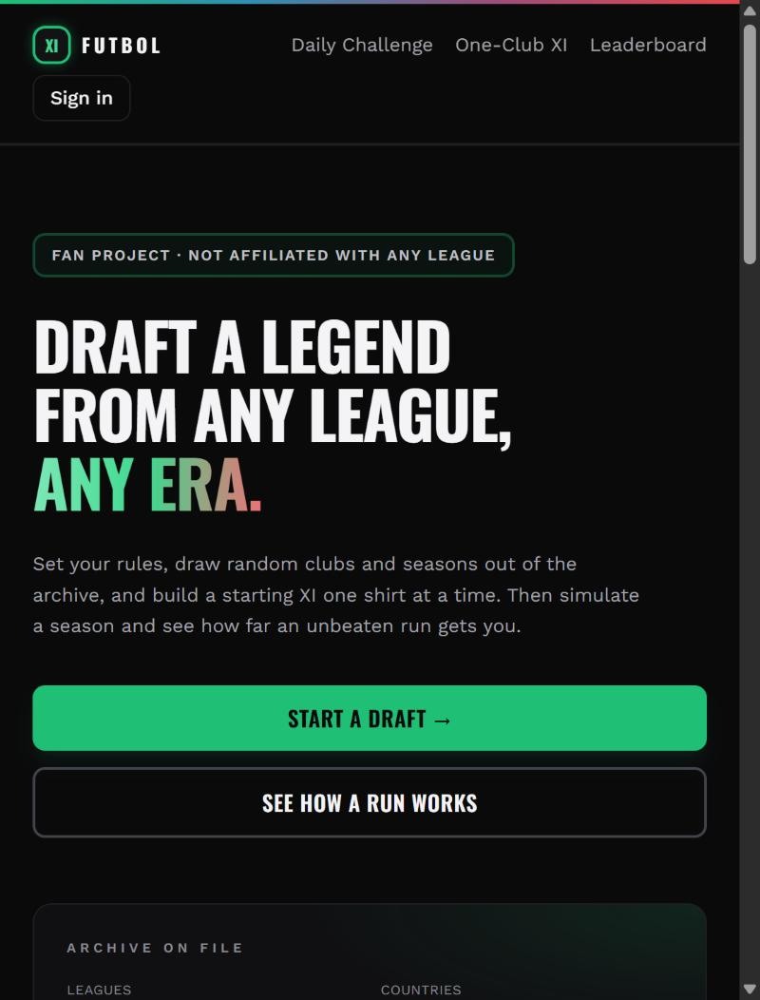

### 4.2 Setup ("Set the rules")

| | 38-0 | Futbol | Do |
|---|---|---|---|
| Layout | Compact grids: formation 4-up, difficulty 3-up, every 2-way choice 2-up. Fits in ~2.5 mobile screens. Each setting group has its own accent colour. "Advanced" is collapsible. | Single column. Difficulty, Show Ratings, Draft Mode and Player Ratings are each **full-width stacked tiles** → ~5 screens at 375px. | **P1** Use 2–3-up segmented controls. Put a sticky "Enter the draft room" bar at the bottom. Remember last-used settings. |
| League | n/a (single league; switch on landing) | Plain text tiles, **alphabetical → Bundesliga default**. No flag, colour, club count, season span or "current champion". **No "All Top-5" option.** | **P1** Default to the last used league (first visit: Premier League). Show a rich league card (flag, colour, clubs, seasons, a well-known current club). **P3** Add "All Top-5" (cross-league draft). |
| Era | Chips + dual slider covering exactly the data (1992/93–2026/27, "35 of 35 seasons"). | Chips + slider **1992–2025** over data that is 2012–2024. Most of the range is empty, and "All-time" means 12 seasons. | **P0** Bound the slider to the real data and show "N of M seasons". **P2** Extend the data window (pre-2012 *and* 2025/26–2026/27). |
| Formations | 12, with a mini pitch preview and a one-line flavour caption | 12, mini pitch, caption | Parity. |
| Colour semantics | Normal = amber, ratings = purple, mode = green, Prime = cyan, January = amber | Normal difficulty and January drawn in **crimson** (reads as "danger/error") | **P1** See §7.1 colour rules. |

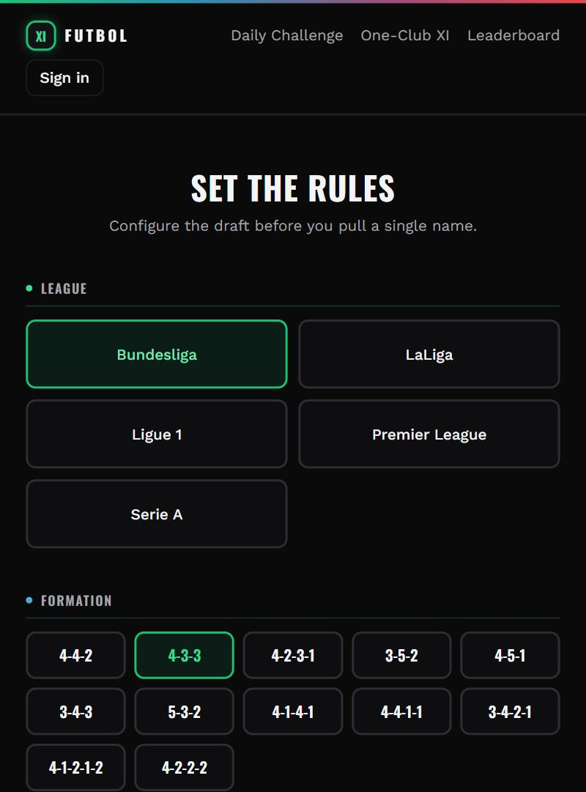

### 4.3 Draft room

| | 38-0 | Futbol | Do |
|---|---|---|---|
| Layout (desktop) | Sticky left sidebar (formation, reroll pips, progress, pitch, Move a player, OVERALL panel) + right action column. | Two columns on desktop, single column on mobile. | Parity on desktop. |
| Layout (mobile) | Pitch → OVERALL → spin panel; the pool is a normal page list. | Stat tiles → **full-height pitch** → Move → legend → reel → pool in a **nested 320px scroll box** (`max-h-80`). You scroll past the pitch for every draw, then scroll inside a box. | **P1** Compact pitch on mobile (collapsible, or a sticky mini-pitch strip). Remove the nested scroll. Add a sticky bottom "Make the draw" bar. |
| Assigning a player | Tap a player → an **inline "Place in (N)" panel** under that row lists *only* the open slots that player can play → one tap. | Tap a player → "Choose a position for X" → **scroll up to the pitch** and tap a slot. All slots stay clickable; a wrong slot shows an error after the fact. Auto-assign happens only when one slot is left. | **P1** Copy the inline "Place in" pills. Highlight valid slots on the pitch and dim the invalid ones. Auto-assign when exactly one slot fits. |
| Player rows | Rating tile coloured by position group, name, nationality, **up to 3 eligible-position chips** | Photo + rating badge, name, nationality, **1 primary-position chip** | **P1** Show every eligible position (versatility is a core decision). Keep the photos (an advantage). |
| Pitch labels | Code + full label ("RB · Right Back"), surname after the pick | Code + **ambiguous label** ("Left" for both LB and LW), full name truncated ("Leighton Bai…") | **P1** Full position names; surname only on the pitch. |
| Live OVERALL | After the first pick: overall + 4 unit bars | After the first pick: overall + tier pill + 4 unit bars | Parity (fix B2 colours, and the tier inflation in §5). |
| Reroll indicator | Amber pip(s) + N/11 + progress bar | "Redraws 1 •" tile + "Filled 0/11" tile | Fine. |
| Season label | "Chelsea **2003/04**" + club colour dot | "LIVERPOOL FC **2013**" | **P0** B8. Add a club colour dot (club colours are cheap and not trademarked). |
| Persistence | `fuseState` lives in the URL; "Continue Draft" on the landing page | Lost on reload | **P0** B13. |

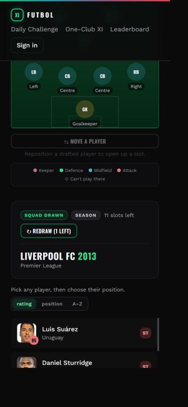
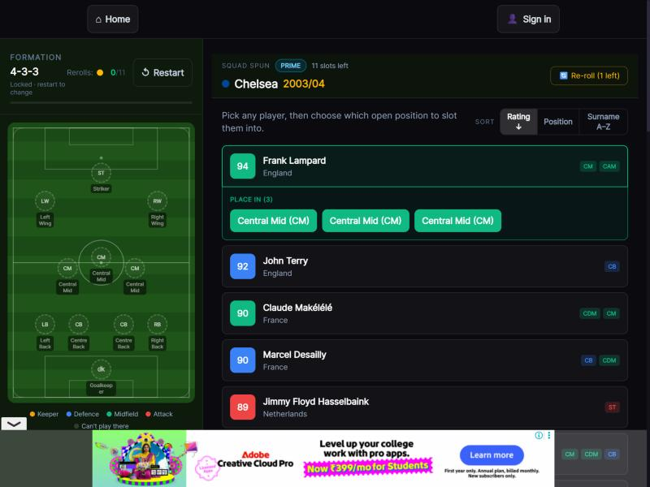

### 4.4 Manager step

| | 38-0 | Futbol | Do |
|---|---|---|---|
| Copy | A manager changes the style, *not* your odds | A real manager's tactics change how you play *and* your odds | Your choice is fine (it's true in Futbol), but then **show the delta**: "Kompany: +1.8 expected pts, more goals both ways". |
| Reveal | Name reel → "Your gaffer" card: flavour line + plain-English mechanical line → "Continue with Klopp" | Name reel → jumps straight to Squad Complete. The card headline is the **nationality ("BELGIUM")**, with 5 unlabelled tags (ATTACKING · BALANCED · WIDE · HIGH PRESS · SHORT PASSING). | **P1** Add the confirm step. Make the name the headline. Label the tags ("Mentality: Attacking · Tempo: Balanced…") or turn them into one plain-English sentence. |

### 4.5 Pre-season projection

| | 38-0 | Futbol | Do |
|---|---|---|---|
| Content | Projected finish, expected points, Win / Top 4 / Top 6 / Top 10 / Relegation, each in its own colour | Same shape | Parity in layout. |
| Credibility | Projected 2nd / 80 → finished 2nd / 72 (plausible) | **Projected 4th / 89** → won the league on 69. "Top 4 (Europe)" while Europe takes 8. | **P1** Recalibrate (§5.3). Fix the copy (B11). |

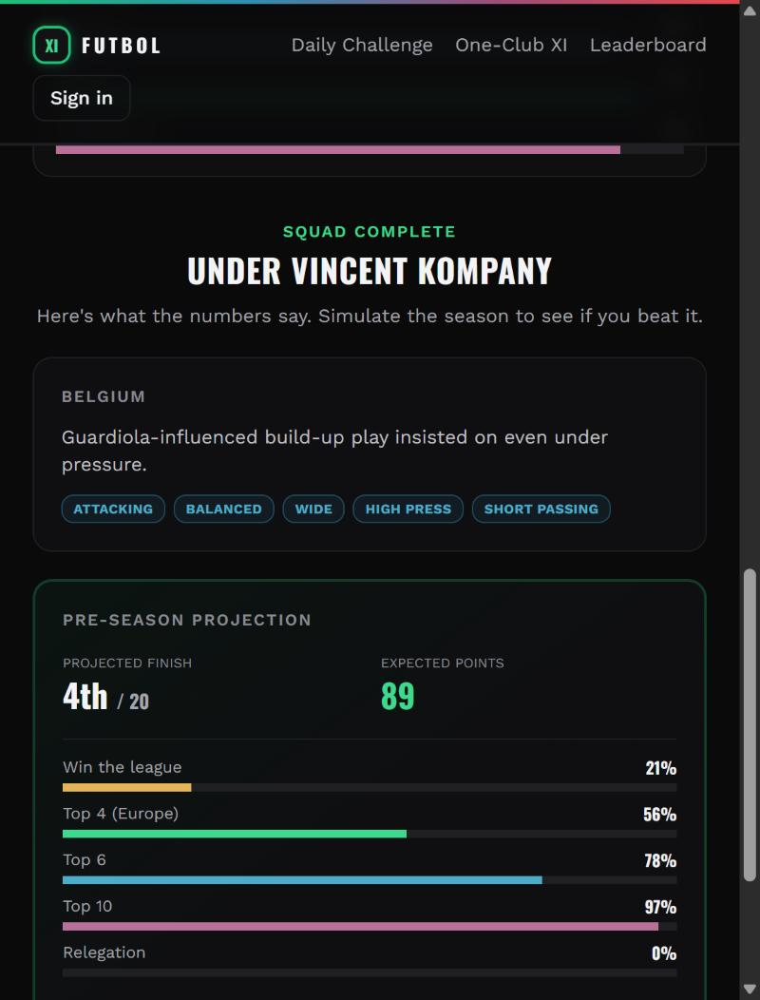

### 4.6 Auth / identity gates

| | 38-0 | Futbol | Do |
|---|---|---|---|
| When asked | Never before simulating. Asked to pick a handle only when submitting to the leaderboard, plus a soft "Don't lose this season" card after the season. | **Modal before simulate** ("One more thing — pick a username"). Plus "Save your progress" in the header, plus "Don't lose this season — add an email and password" after the season. | **P1** Let guests simulate without a username (a local guest id is enough). Ask at leaderboard submit / save. |
| Method | Passwordless: Apple / Google / Microsoft / X / email magic link | Username → later email + password | **P2** Add Google and an email magic link. Drop passwords from the main path. |

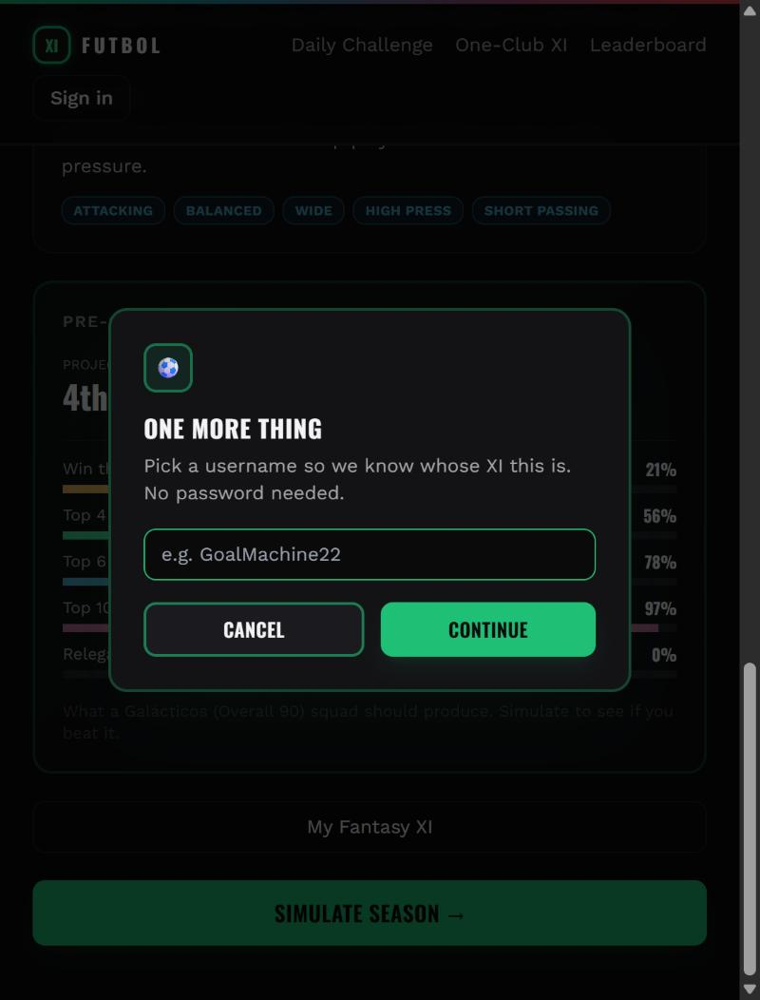

### 4.7 Season reveal

| | 38-0 | Futbol | Do |
|---|---|---|---|
| Start | Results start ~2s after "Simulate Season" | Navigates to `/season` → **second "Simulate season" click** → "Starting…" → "Kicking off…" (~8–10s) | **P1** One click: navigate and start immediately. Show a pre-match "Matchday 1" card while the backend warms up. |
| Pace | ~25s for 38 games; "Skip to January →", then "Skip all →"; 1x/2x speed in Europe | ~2.5s per match (≈90s+); "Skip ahead" only | **P1** Target ~0.6s per match (scale by goals). Add a speed toggle and "Skip to January" / "Skip to end". |
| Feed | Window of the ~3 newest cards; colour-tinted by result; surnames + minutes; progress header "Matchweek 12 / 38" | Accumulating list in a nested scroll box; full names ("Wilfried Zaha 15', Wilfried Zaha 74'"); **W in teal/blue** | **P1** Surnames, W in green (§7.1), no nested scroll; collapse older cards. |
| Context | Running W/D/L/Pts + GF·GA·GD | Same | Parity. **P3 opportunity:** a live mini-table (your position ± 2 rows) that updates as matchdays land — a whole-league feature 38-0 can't match. |
| End | Straight into the results page | **"Wrapping up the season…" ~27s** dead screen | **P1** Run finalisation in parallel with the last cards. Never show a blank wait at the climax. |

### 4.8 January Transfer Window

| | 38-0 | Futbol | Do |
|---|---|---|---|
| Halfway panel | W-D-L, Points, GD tiles; a sentence with goals for/against and **projected league position**; feed stays visible underneath | W/D/L/Pts; "on course for 82 points" (no position); the feed disappears | **P1** Add projected position + GD. **P3** Show the live league table at the halfway mark (a whole-league advantage). |
| Gamble flow | "Enter the transfer market" (amber) → **event-type reel** ("Working the phones…") → a named event card with its premise (Bargain Buy, Wheeler Dealer, …) → resolution (a wheel spin, or 3 blind options to choose from) → Done Deal OUT/IN + verdict | "Enter the transfer market" (crimson) → club×season reel → Done Deal | **P1** Add an **event layer**: 4–6 named event types with different mechanics (one blind signing; choose 1 of 3; loan swap; "star wants out" downgrade; injury crisis; deadline-day panic buy). Reuse the reel for the event type. |
| Sharing | A dedicated January share card | "Copy January result" (text) | **P1** An image card (§4.9). |

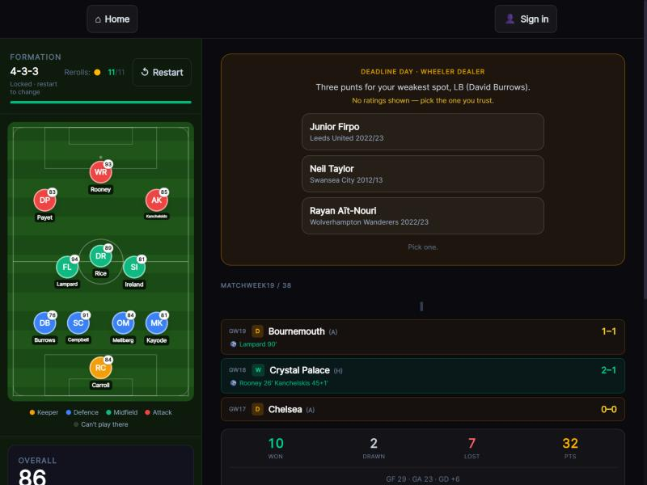
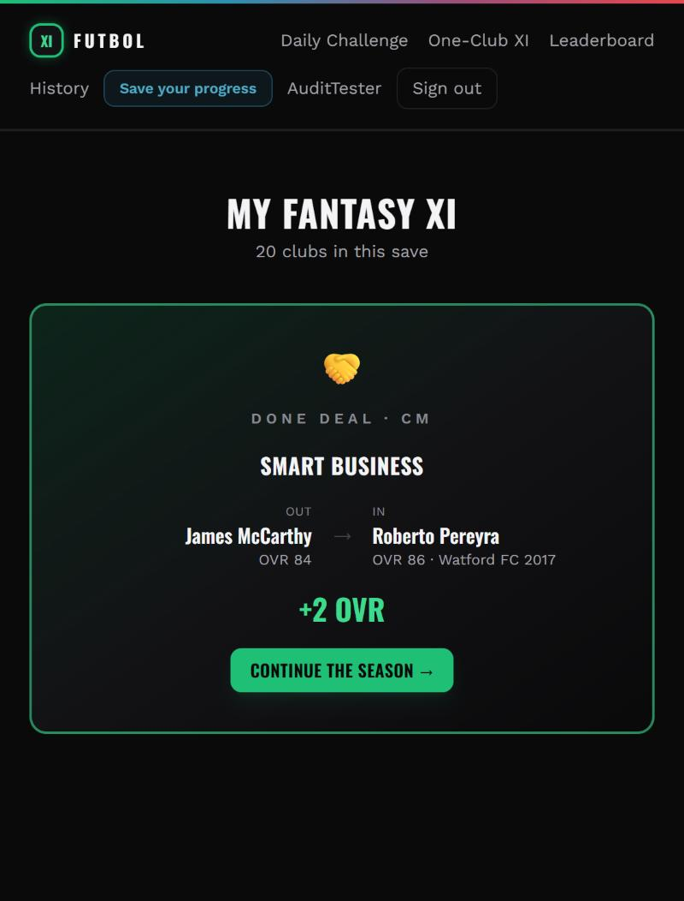

### 4.9 End of season: results, story, awards, share

| | 38-0 | Futbol | Do |
|---|---|---|---|
| Order | Results log → trophies earned → cross-sell → **story** (verdict, unit tiers, composition, a finish headline + paragraph, January lines, standout + pundit quote, a manager line tied to what happened) → **Europe CTA** → Your XI stats → totals → **share** → save prompt → awards → manager card → table (collapsed) → leaderboard → New Run | Standings → team stats → (auto) Champions League → hub. Hub: headline → trophies → result card → copy share → leaderboard → save prompt → **tabs (CL default)** → … → **Season Story buried under the League tab** below a 20-row table | **P1** Make the story the hero (first thing after the result). Default to the League tab. Put the table and full log behind expanders. |
| Story quality | Every line references real outcomes (biggest win, goals, January impact, the manager's style vs the result) | Templated, but has bugs B3/B4, and the manager line just quotes the philosophy | **P1** Fix the bugs; tie the manager line to stats ("Kompany's high press: 16 clean sheets, best defence in the league"). |
| Awards | Golden Boot / Playmaker / Golden Glove / Player of the Season — **your XI only** | Same four — **across all 20 clubs** + a top-10 scorers table | **Futbol advantage — keep.** Add "your best" alongside the league winner. Label MVP's "6.6" as an average match rating. |
| Trophies earned | Shown as a card right after the log | Champions + MVP cards; **no CL trophy / Double** | **P0** B19. |
| Share | **Image card** (Season / January tabs): verified badge, difficulty·ratings, OVR, W-D-L, pts/finish, trophy pill, XI in 2 columns, manager, Golden Boot, POTS, URL. Buttons: Share (native), Save image, WhatsApp, Copy caption. | "Copy result to share" (text to clipboard) | **P1 (highest growth lever).** Render a 1080×1350 card (html-to-image or a server-rendered OG image). Native share, Save, WhatsApp, Copy caption. Season, January and Europe variants. Include league + flag. |
| Next step | "Europe comes calling" opt-in card · New Run · cross-promo for another mode | Auto-continues into Europe | **P1** Make Europe an opt-in *moment* (§4.10). |

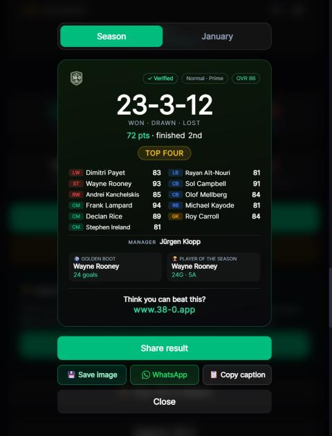
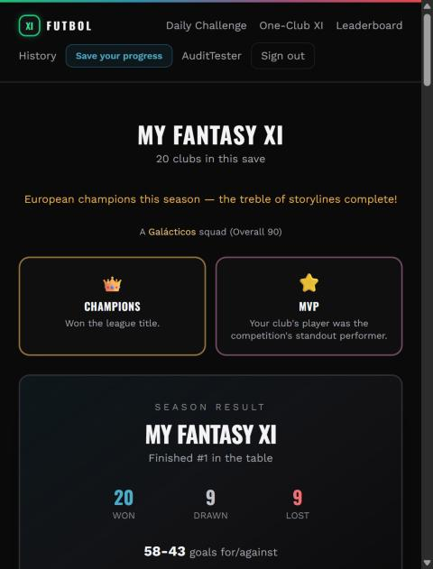

### 4.10 European competition — the biggest multi-league gap

| | 38-0 (single league!) | Futbol (five leagues) | Do |
|---|---|---|---|
| Entry | An opt-in card on results; a full-screen takeover with its own navy/blue skin and stage progress bar | Auto-starts after standings; ~31s "Kicking off the Champions League…" | **P1** An opt-in moment with its own skin. |
| Opponents | **Real continental clubs** (Salzburg, Lille, Milan, Sevilla, PSG, Inter, Villarreal, Atalanta) shown as an 8-team "draw" with coloured club badges | **Your own league's top 8** (Bournemouth, Wolves, Brighton, Villa…) — the same teams you just played twice | **P3 (top priority in the moat).** You already have five leagues of real current squads. Pool qualifiers from all five leagues into a real league phase (e.g. 36 clubs: top ~7 per league + extras). Do a draw reveal. |
| Format | 36-team league phase (8 games) → zones (1–8 bye, 9–24 play-off, 25–36 out) → PO / R16 / QF / SF / Final; the whole competition is simulated, with a real champion if you're out | An 8-team round robin where **all 8 advance** (the league phase only seeds) → QF / SF / Final | **P3** A real format with something at stake in the league phase. |
| Depth | Three competitions (CL-, EL- and Conference-style), 18 Europe trophies, "Elsewhere in Europe" results, a full bracket, a campaign summary, an Europe share card | One competition, no Europe trophy, a bracket without scores | **P2–P3** Second/third tiers keyed to finish position; Europe trophies; a share card. |
| Naming | Avoids trademarks ("European Nights") | Uses "Champions League" | **P1** Rename (e.g. "European Nights", "Continental Cup"). The legal posture should match the footer disclaimer. |

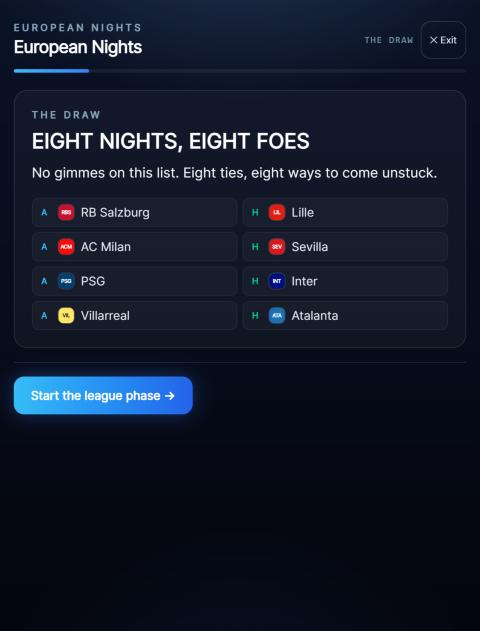
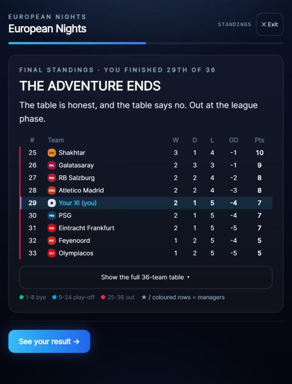
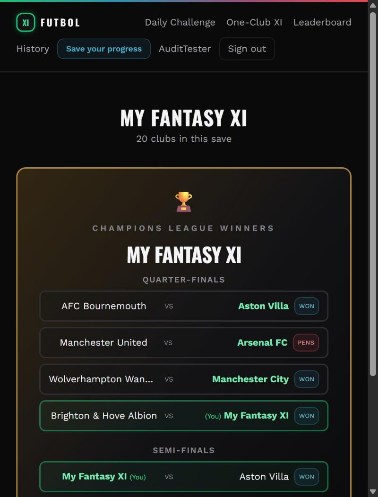

### 4.11 History vs Profile (retention)

| | 38-0 `/profile` | Futbol `/history` | Do |
|---|---|---|---|
| Content | Career stats (seasons, best points, best record, win rate, most goals, top-rated XI, titles, 38-0s, favourite formation, play streak); streaks; a **trophy cabinet** with 82 trophies (earned + locked with conditions and progress, rarity, EXCLUSIVE tags, ×N counts), league tabs, a weekly highlight with "Start a run"; share cabinet; "View your last season"; "Your leagues" | A list of runs: name, formation, date (US format), points, tiny trophy tiles | **P2** Build `/profile`: stats, streaks, a cabinet with locked trophies. Each run row shows **league flag**, finish, W-D-L, and links back to its stats hub. |
| Trophy design | Mostly **squad-composition** goals (11 nationalities, 6 Brazilians, all-English title winners, one-club men, same surname initial, cult heroes…), plus easter eggs, Daily streaks, and Europe chains | Performance trophies only | **P2** Expand the catalogue (§8 has multi-league ideas). Composition trophies make people replay with a plan. |

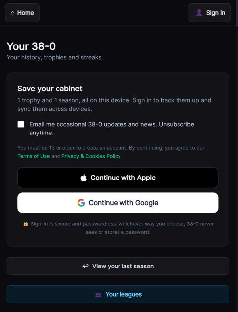
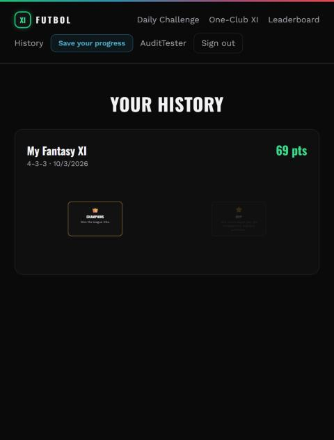

### 4.12 Leaderboard

| | 38-0 | Futbol | Do |
|---|---|---|---|
| Filters | Collapsed "Filters ▾" | **~45 chips expanded by default** (mode, time, difficulty, ratings, league, tier, formation); results start far below the fold on mobile | **P1** Collapse the filters; show active ones as removable pills. |
| Rows | Rank, handle, ✓ verified, difficulty, formation·OVR·ratings, result (38-0 ✨ or W-D-L+GD), pts | Same, plus **league** | Parity, plus league (good). Add a league flag. |
| Data | Real competition | Dev/test entries ("League Test XI", "OneClubLive2"), and every top row is "Galácticos" | **P1** Wipe test data before launch. Fix tier inflation (§5). |

### 4.13 Daily Challenge

| | 38-0 | Futbol | Do |
|---|---|---|---|
| Theme | Tied to the **real calendar** (tonight's international fixtures, birthdays, derbies, news, the Champions League returning) | Procedural ("Club Legends: US Salernitana 1919") | **P2** A small editorial calendar (could be semi-automated from fixtures + birthdays across the **five** leagues — more material than 38-0 has). |
| Load | Instant | **31s** first request; "Loading today's challenge…" | **P0** B17. |
| Start state | Completion odds ~73%, attempt 1/5, rerolls, yesterday's recap (top score, "maxed in 1") | Completion odds **0%**, Rerolls 3/3 + "Reroll this club" shown before any draw, ISO date "2026-10-03" | **P1** Fix the odds start state; add attempts, yesterday's recap and a friendly date. |
| Archive | 112 days, two formats (paid for missed days) | None | **P2** An archive (free or paid — see §9). |

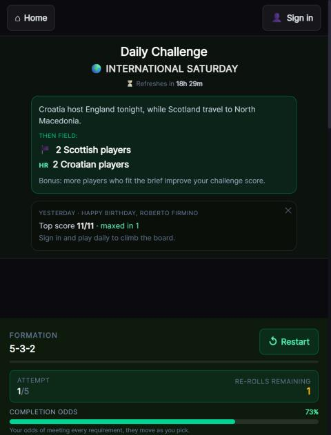
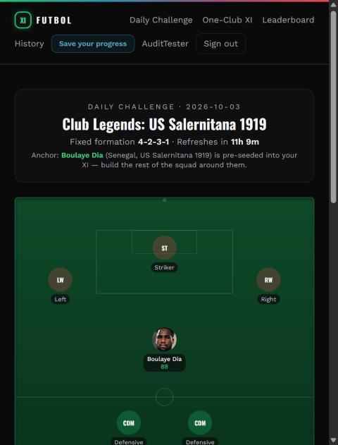

### 4.14 One-Club XI & Nations

| | 38-0 | Futbol | Do |
|---|---|---|---|
| Directory | A rules explainer, a dedicated trophy set (Invincible, Club Record Breaker, Club Worst Ever), per-club boards, then a club list | A flat alphabetical list of **173 clubs across 5 leagues**, raw legal names ("1. Fußballclub Heidenheim 1846", "Associazione Sportiva Roma", "Bologna Football Club 1909"), auto-monogram tiles that read oddly ("11", "B1", "C6"), all the same colour | **P1** Display-name normalisation (Heidenheim, Roma, Bologna). League tabs + search. Club colours on tiles. "Popular" first. A rules/trophy explainer at the top. |
| Nations | Supporter-only limited tournament | A free directory of 136 nations with player counts; monogram tiles | **P1** Flags (emoji flags are free). **P3** Make it a real tournament (group stage vs other nations' all-time XIs). |

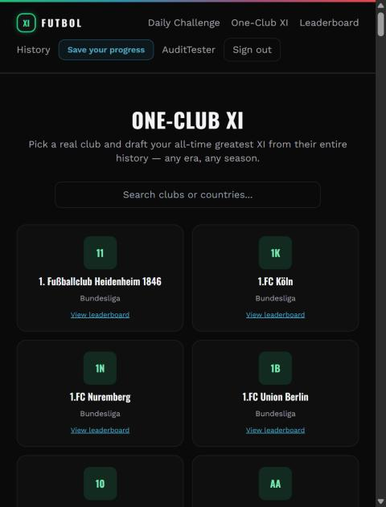

### 4.15 Multiplayer

| | 38-0 | Futbol | Do |
|---|---|---|---|
| Hub | 3 big cards: Live Draft (up to 6), Leagues (async), Last One Standing (survival) | One page: My leagues, invite code, create league (Async/Live toggle), league/difficulty/formation-freedom form | **P1** Split into a card hub + separate create flows. The Async/Live toggle layout breaks on mobile (two tall buttons beside the heading). |
| Events | Scheduled public LOS events with champions | None | **P3** Weekly public events per league ("Serie A Sunday Survival"). |
| Landing discoverability | "Play with mates" section | The stale "Head to head — one device" card; Multiplayer isn't in the header | **P0/P1** B12 + navigation. |

### 4.16 Content, SEO & platform

| | 38-0 | Futbol | Do |
|---|---|---|---|
| Pages | How it works, How to play, Greatest XI (3–4 options per position, conversational), 3 SEO landers with breadcrumbs and Related links, Story, Partners, Download | How it works, How to play, Best XI (one fixed XI, 2012–24), Story | **P2** Per-league Best XIs ("Greatest Serie A XI", "Greatest Bundesliga XI") — five times the SEO surface. Add "draft this player" CTAs. |
| Titles/meta | Per-route `<title>` | The same title on every route | **P1** Per-route titles (a tiny hook, no library needed). |
| 404 | Branded 404 | Blank | **P0** B15. |
| Apps/PWA | iOS + Android + an install guide | Manifest only | **P2** PWA install prompt + offline shell; a store wrapper later. |
| i18n | League switch (EN/ES); Spanish trophy names | English only | **P3** You have five language markets. Start with ES/IT/DE/FR UI strings once the copy is stable. |
| Feedback | mailto with a template, Discord | None | **P1** A feedback link. |

---

## 5. Simulation & data credibility (the "feel" problem)

38-0's whole hook is *tension*: "you're projected 2nd — can you beat it, can you go 38-0?" That only works if ratings, projection and results are believable. Today Futbol's are not.

### 5.1 Rating inflation
- Observed: Butland 89, Mings 90, Gvardiol 98, Baines 92, Ritchie 87, Pereyra 86, Boulaye Dia 88. XI overall 90 with mostly mid-table players. Every leaderboard top row is "Galácticos". Every unit tier is "Elite".
- 38-0 reference: KDB 93 and Lampard 94 are near the ceiling; a strong cross-era XI lands at 85–87.
- **Do (P1/P2):** re-fit the OVR curve (`tools/data-etl`) so that 90+ is genuinely world-class (top ~1–2% of player-seasons) and a typical drafted XI sits at 80–86. Re-cut `squadTierName()` and the narrative unit bands as **percentiles of drafted XIs** rather than fixed thresholds, so "Galácticos" stays rare. (Memory note: the July recalibration set floor 70 / median 81. Pushing the top tail down matters more than the median.)

### 5.2 AI league realism
- Observed: champion 69 pts, 2nd 61, last 37; Liverpool 11th, Man City 7th, Chelsea 18th, Southampton 10th.
- Real top-flight shape: champion ~85–95, relegation line ~35, big clubs mostly in the top 6.
- **Do (P2):** make AI club strength track real current hierarchy (current-season squads, best XI selection, maybe a club-reputation prior). Add a **table-shape metric** to `tools/sim-lab` (champion points, points spread, rank correlation with club strength), not just goal distributions.

### 5.3 Projection ↔ outcome calibration
- **Do (P1):** fit `computePreseasonOdds` to the engine's actual behaviour. Run N seasons per overall bucket offline in sim-lab, record finish/points distributions, and ship that mapping. Persist the shown projection so the verdict uses it (B3).

### 5.4 Goal attribution
- After fixing B1, re-check that strikers/wingers take the bulk of goals (sim-lab metric: share of team goals by position group; ST ≈ 30–45%). One more oddity: a "Galácticos" XI lost 0-7 at home to Man United. Check the tails of the variance.

### 5.5 Data window
- 38-0: 35 English seasons including the current 2026/27; Spain since 1997/98. Futbol: 13 seasons (2012–2024), no 2025/26 or 2026/27.
- **Do (P2):** add current seasons first (draft "this season's" stars, and AI clubs that match reality). Then extend backwards (the standing pre-2012 backlog item). Update the era slider bounds and the landing copy to match.

---

## 6. Visual design & UX system review

### 6.1 Colour semantics (mint system kept, meanings fixed)
| Meaning | Today in Futbol | Recommended |
|---|---|---|
| Win / positive / primary CTA | W badge **teal**, WON stat **teal** | **Green (mint)** for W and positive deltas. Every football UI uses green for a win. |
| Loss / danger | Crimson (fine) | Crimson |
| Draw / neutral | Grey | Grey/amber-muted |
| Gamble / risk | **Crimson** (January CTA, Normal difficulty) | **Amber** (38-0 uses amber for risk; crimson reads as an error) |
| Trophy / celebration | Amber | Gold/amber, reserved |
| Position groups | Two conflicting maps (B2) | One map, from `GROUP_FILL` |

### 6.2 Density & typography
- Oswald uppercase is used for everything (headings, buttons, tab labels, chips), plus full-width tiles everywhere. On mobile this costs a lot of vertical space and reads as shouting.
- **Do (P1):** keep Oswald for headings and numbers. Use sentence-case Work Sans for buttons, chips and labels. Move to 2–3-column segmented controls. Aim for 38-0's information density per screen.

### 6.3 Layout patterns to adopt
- Sticky bottom action bar on mobile for the primary action (Make the draw · Simulate · Continue).
- No nested scroll containers (the draft pool, the match feed).
- Inline contextual actions (Place-in pills) instead of "go somewhere else and tap".
- A full-screen "takeover" skin for special moments (Europe, January), so they feel like events.
- Results-first hierarchy: hero result → story → share → details behind expanders.

### 6.4 Loading, waiting and errors
- Replace bare "Loading…" with skeletons. Replace "Internal server error" with retry + human copy.
- No dead waits longer than ~2s at climaxes (season end, Europe start): overlap the backend work with animation.

### 6.5 Accessibility quick wins
- Muted grey text on near-black (`smoke-600` on `ink-950`) and 10px legend text fall below comfortable contrast/size. Raise them to ≥ 4.5:1 and ≥ 12px.
- Space-to-spin exists (good). Add `aria-live` for the result feed, and a focus trap in modals.

---

## 7. Where Futbol is already ahead (protect these)
1. **Real player photos** on cards and the pitch. Note the risk: these hotlink Transfermarkt images, and 38-0 deliberately uses none. Keep them, but make sure the footer/legal posture covers it, and have an "initials" fallback that looks intentional (it exists).
2. **League-wide realism**: awards, top-10 scorers across all clubs, and a full 10-column table. 38-0 only reports your own XI.
3. **Five real leagues** with real current clubs as AI opponents, a league filter on the leaderboard, and a league choice for multiplayer leagues.
4. **Managers with genuine mechanical effect**, plus a manager stat card.
5. **Multiplayer breadth** already built: async leagues + turn-based live draft (WebSocket).
6. **Nations across 136 nationalities**, free (38-0 paywalls Nations).

---

## 8. The multi-league moat — what only Futbol can do

38-0 is one league deep and is adding a second. Futbol should make *five leagues* the thing people talk about.

1. **Real cross-league European Nights (P3, top priority).** Qualifiers from all five leagues' current clubs, a 36-team league phase, a draw reveal with club colour badges, PO → Final, and "Elsewhere in Europe" results. Add second/third-tier competitions keyed to finish position. The data already exists in `RefClubSeason`.
2. **"All Top-5" draft** (Decision B in the revamp plan, still unbuilt): the wheel spans all five leagues' histories, and you choose which league your XI plays in (or a synthetic "Super League" of each league's current top 4).
3. **League identity everywhere**: flag, accent colour and wordmark per league on Setup, the draft header, results, the share card and history rows. 38-0 re-themes the whole site for Spain; Futbol can do it for five.
4. **League-flavoured narrative & awards**: league-specific golden-boot names, idioms and rivalry lines (Clásico, Klassiker, Derby della Madonnina, Le Classique, North-West derby) in the story generator.
5. **Cross-league trophies**: win the title in all five leagues; field players from all five leagues; win Europe with an XI from a single league that isn't yours; one nationality across five leagues; a per-league trophy tab like 38-0's ENG/ESP.
6. **Daily themes from five fixture calendars + birthdays** — five times the editorial material.
7. **Per-league Best XIs and SEO pages** ("Greatest LaLiga XI", "Greatest Serie A XI").
8. **Mid-season live table**: a whole-league view (position ± 2 rows) during the reveal and at January — something a fixtures-only feed can't show.
9. **January events that cross borders** ("Bundesliga bargain", "Serie A loan swap").
10. **Nations Trophy as a tournament** across the five-league player pool (groups + KO vs AI nations).

---

## 9. Business, growth and platform (decide deliberately)
- **Monetisation:** 38-0 now runs a pay-what-you-want Supporter Pass (no ads, Daily archive, tournaments, "full stats") plus display ads for everyone else. If Futbol plans to monetise, the Daily archive, extra Daily formats and cosmetic share-card themes are low-friction paid perks. Keep the core loop free. Avoid ads in the draft/reveal path.
- **Growth loop:** image share cards (§4.9) + a challenge link ("beat my XI": same rules, link opens a pre-configured setup) + a weekly public event per league.
- **Accounts:** passwordless (Google + magic link).
- **Platform:** PWA install, push for "today's Daily is live" (later), and a store wrapper only once retention justifies it.

---

## 10. Prioritised roadmap

| Priority | Items | Effort |
|---|---|---|
| **P0 — now (1–3 days)** | B1 lineup fidelity (+ tests, + audit of all club-creation paths) · B2 legend colours · B3/B4 narrative fixes · B5 daily copy · B6–B12 copy/label fixes · B13 draft persistence + Continue draft · B14 scroll reset · B15 404 + signin redirect · B16 retry/backoff · B17 pre-generated daily · B18 bracket scores/stage labels · B19 Europe/Double trophies | S–M each |
| **P1 — UX parity (1–2 weeks)** | Compact mobile header/nav · compact Setup + remembered settings + rich league cards · inline Place-in + valid-slot highlighting + all eligible position chips · no nested scrolls + sticky action bar · single Simulate click, no username gate · faster reveal + speed + skip-to-January · January event-type layer + halfway position/GD · results hub reordered (story first, League default) · image share cards (season / January / Europe) with native share/WhatsApp/save · Europe opt-in takeover + rename from "Champions League" · collapsed leaderboard filters + wipe test data · club display names + league tabs + flags · per-route titles · colour semantics (§6.1) · feedback link | M |
| **P2 — credibility & retention (2–4 weeks)** | OVR re-fit + percentile tiers · AI league realism + table-shape sim-lab metric · projection calibrated from sim runs · goal-attribution check · current-season data (2025/26, 2026/27), then pre-2012 · `/profile` with stats, streaks, trophy cabinet (locked + progress + rarity) · trophy catalogue expansion (composition trophies) · Daily calendar themes + archive + recap + attempts · passwordless auth · PWA install · per-league Best XI pages | M–L |
| **P3 — multi-league moat (4–8 weeks)** | Real cross-league European Nights (36-team, 2–3 tiers) · All Top-5 draft · league identity theming · league-flavoured narrative/award names · cross-league trophies · mid-season live table · Nations tournament · weekly public multiplayer events · i18n (ES/IT/DE/FR) | L |

---

## Appendix A — My 38-0 run (2026-10-03)
- **Setup:** 4-3-3, Normal (1 reroll), ratings on, Squad First, Prime, All-time, all advanced on.
- **Draft (11 spins, one pick each):** Lampard (Chelsea 03/04, 94, CM) · Payet (West Ham 15/16, 83, LW) · Kanchelskis (Southampton 02/03, 85, RW) · Rice (West Ham 16/17, 89, CM) · Burrows (West Ham 93/94, 76, LB) · Campbell (Spurs 94/95, 91, CB) · Rooney (Everton 17/18, 93, ST) · Carroll (Derby 07/08, 84, GK) · Kayode (Brentford **2026/27**, 81, RB) · Ireland (Stoke 14/15, 81, CM) · Mellberg (Villa 04/05, 84, CB). **Overall 86** (ATT 87 / MID 88 / DEF 84 / GK 84).
- **Manager:** Jürgen Klopp. **Projection:** 2nd, 80 pts (Win 16.5% · Top 4 84.4% · Top 6 95% · Top 10 99.7% · Rel 0%).
- **Halfway:** 10-2-7, 32 pts, GD +6, "on course for 6th". **January:** event *Wheeler Dealer* → 3 blind LB options → signed Aït-Nouri (81) for Burrows (76), +5.
- **Final:** 23-3-12, **72 pts, 2nd**, 77 GF / 41 GA. Verdict *Bang on script*. Golden Boot Rooney 24, Playmaker Kanchelskis 12, Golden Glove Carroll 18, POTS Rooney. Manager card: 18 CS, 7-game win streak, biggest win 6-0, highest-scoring 4-5. Trophy: Top Four.
- **Europe:** draw vs Salzburg, Lille, Milan, Sevilla, PSG, Inter, Villarreal, Atalanta → 2-1-5, **29th of 36, out**. Champions: Real Madrid (beat Napoli 2-1).

## Appendix B — My Futbol run (2026-10-03)
- **Setup:** Premier League, 4-3-3, Normal, ratings on, Squad First, Season, All-time (1992–2025 slider), all advanced on.
- **Draft:** Suárez (Liverpool "2013", 95, ST) · Baines (Everton "2012", 92, LB) · Mings (Villa "2019", 90, CB) · Gvardiol (Man City "2024", 98, CB) · Lovren (Southampton "2013", 87, CB → placed at RB) · McCarthy (Wigan "2012", 84, CDM) · Fàbregas (Chelsea "2015", 93, CM) · Gueye (Everton "2017", 88, CM) · Zaha (Palace "2020", 90, LW) · Ritchie (Newcastle "2018", 87, RW) · Butland (Stoke "2017", 89, GK). **Overall 90 "Galácticos"**, all units Elite.
- **Manager:** Vincent Kompany. **Projection:** 4th, 89 pts (Win 21% · Top 4 56% · Top 6 78% · Top 10 97% · Rel 0%).
- **Gate:** username modal before simulate → second Simulate click on `/season`.
- **Halfway:** 12-5-2, 41 pts, "on course for 82 points". **January:** McCarthy (84) → Pereyra (Watford "2017", 86), +2.
- **Final:** 20-9-9, **69 pts, champions** (2nd Wolves 61). Top scorer **Lovren 16**, Zaha 14, Ritchie 14, **Suárez 1** (see B1). League awards: Golden Boot Nketiah (Palace) 20, MVP Zaha 6.6, Playmaker Mac Allister 14, Golden Glove Raya 16. Verdict *As expected* (see B3).
- **"Champions League":** 8 Premier League clubs → 3-1-3, 5th of 8 → QF beat Brighton → SF beat Villa → Final beat Man City → **winners**. No trophy awarded (B19).

## Appendix C — Screenshot index
`plans/assets/38-0-vs-futbol-2026-10/`
- 38-0: `3800-01-setup-advanced` · `02-draft-squad-spun` · `03-draft-inline-place-in` · `04-your-xi-list` · `05-preseason-odds` · `06-season-reveal` · `07-january-halfway` · `08-january-wheeler-dealer` · `09-january-done-deal` · `10-europe-draw` · `11-europe-standings` · `12-europe-fulltime-card` · `13-share-season` · `14-share-january` · `15-profile-cabinet` · `16-spanish-league-mode` · `17-multiplayer` · `18-daily`
- Futbol: `futbol-01-landing` · `02-setup-league` · `03-draft-mobile-header` · `04-draft-pool-mobile` · `05-pitch-photos-overall` · `06-preseason-projection` · `07-guest-gate-before-simulate` · `08-season-second-simulate-click` · `09-season-reveal` · `10-january-halfway` · `11-january-done-deal` · `12-team-stats-lovren-top-scorer` · `13-cl-winners-no-scores` · `14-hub-top` · `15-history` · `16-leaderboard-filters` · `17-daily` · `18-one-club-directory`

## Appendix D — Page inventory

| 38-0 page | Futbol equivalent | Status |
|---|---|---|
| `/` hub with Today / mates / more ways | `/` | Exists — needs hub structure |
| `/game` (setup → draft → result, URL state) | `/setup`, `/draft`, `/season` | Exists — persistence missing |
| European Nights takeover | Inside `/season` | Exists — needs a real cross-league field |
| `/daily`, `/daily/archive` | `/daily` | Archive missing |
| `/clubs` | `/clubs` | Exists — needs naming/grouping |
| `/tournaments` (Nations, Nations 2006) | `/nations` | Exists (free) — not a tournament |
| `/european-nights-draft` | — | Missing (natural fit for multi-league) |
| `/chain` (Teammate Chain) | — | Missing (cheap trivia mode; five leagues give more chains) |
| `/multiplayer` (Live / Leagues / LOS) | `/multiplayer`, `/leagues/:id`, `/live/:id` | LOS missing |
| `/leaderboard` | `/leaderboard` | Exists — filters UX, test data |
| `/profile` (stats, streaks, cabinet) | `/history` | Thin |
| `/how-it-works`, `/how-to-play`, `/best-xi`, `/story` | Same | Exists |
| SEO landers (draft game, XI builder, season simulator) | — | Missing |
| `/supporter`, `/partners`, `/refunds` | — | Business decision |
| `/download` (apps + PWA guide) | — | Missing |
| 404 | blank | Missing |
